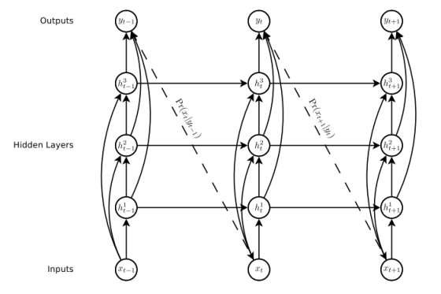

# Deep Learning Tricks

This is an attempt to enumerate different machine learning training tricks I gather around. The goal is to briefly give a description of the trick as well as an intuition about why it is working. My knowledge is quite limited so this is prone to errors/imprecisions. This should be a collaborative work so feel free to complete or correct. 
The excellent [CS231n](http://cs231n.github.io/) Stanford course already has a good list of training tricks.

## Data prepossessing

## Initialisation

**What**: Initialising the weights correctly can improve the performances and speed up the training. Bias usually initialized at 0. For the weights, some recommend using uniform within:
 * For linear layers \[1\]: [-v,v] with v = 1/sqrt(inputSize)
 * For convolution layers \[2\]: [-v,v] with v = 1/sqrt(kernelWidth\*kernelHeight\*inputDepth)
Batch normalisation \[3\] seems to reduce the need for fine tuned weight initialisation.

**Why**: TODO 
**Ref**:
 1. *Stochastic Gradient Descent Tricks, Leon Bottou*
 2. ?? (default used by Torch)
 3. *Batch Normalization: Accelerating Deep Network Training by Reducing Internal Covariate Shift, S. Ioffe and C. Szegedy* (https://arxiv.org/abs/1502.03167)

**What**: For LSTM, initialize the forget bias to one. This speed up the training. 
**Why**: The intuition is that at the beginning of the training, we want the information to propagate from cell to cell, so don't wan't the cell to forget its state. 
**Ref**: *An Empirical Exploration of Recurrent Network Architectures, Rafal Jozefowicz et al.* (cites the trick but not the original authors)

## Training

**What**: In addition to the ground truth 'hard' targets, we can also train a network using the soft targets (softmax output) from another model. 
**Ref**: *Dark knowledge, G. Hinton*

## Regularisation

## Network architecture

**What**: Use skip connection. Directly connect the intermediate layers to the input/output. 
**Why**: From the authors: "*make it easier to train deep networks, by reducing the number of processing steps between the bottom of the network and the top, and thereby mitigating the ‘vanishing gradient’ problem*" 
**When**: Used in RNN if the number of layers is important or in some CNN architectures. 
**Ref**: *Generating Sequences With Recurrent Neural Networks, Alex Grave et al.* (https://arxiv.org/abs/1308.0850)

 
*Example of skip connection on a RNN*

**What**: Add peephole for LSTM (connect the previous output to the gate's inputs). According to the authors, it would help for long time dependencies when the timing is important. 
**Ref**: *Learning Precise Timing with LSTM Recurrent Networks, Felix A. Gers et al.*

### Seq2seq

**What**: For seq2seq, reverse the order of the input sequence (\['I', 'am', 'hungry'\] becomes \['hungry', 'am', 'I'\]). Keep the target sequence intact. 
**Why**: From the authors: "*This way, [...] that makes it easy for SGD to “establish communication” between the input and the output. We found this simple data transformation to greatly improve the performance of the LSTM.*" 
**Ref**: *Sequence to Sequence Learning with Neural Networks, Ilya Sutskever et al.* (https://arxiv.org/abs/1409.3215)

**What**: For seq2seq, use different weights for the encoder and decoder networks. 
**Ref**: *Sequence to Sequence Learning with Neural Networks, Ilya Sutskever et al.* (https://arxiv.org/abs/1409.3215)

**What**: When training, force the correct input on the decoder, even if the decoder predict a wrong output at the previous step. On testing, use. This make the training much efficient at the beginning. [2] propose an improvement by gradually going from a 'all decoder inputs taken from ground truth' to a 'all decoder inputs taken from previous step prediction' (randomly sampled with a chosen decay to gradually goes from one mode to the other). Seems harder to tune (add a few additional hyperparameters). 
**Ref**:
 1. *??*
 2. *Scheduled Sampling for Sequence Prediction with Recurrent Neural Networks, Samy Bengio et al.* (https://arxiv.org/abs/1506.03099)

## Network compression

**What**: To reduce the number of layers, the batch normalisation layers can be absorbed into the weights by modifying them. This works because batch normalisation simply perform a linear scaling. 
**Ref:**:*??*
