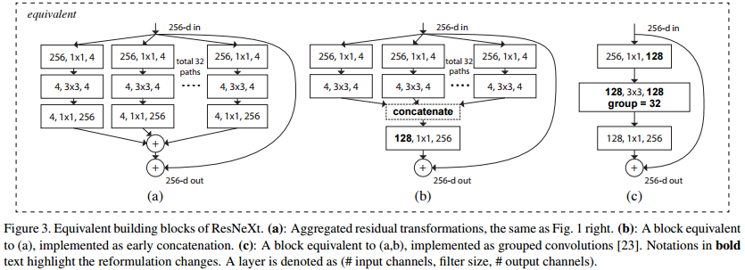
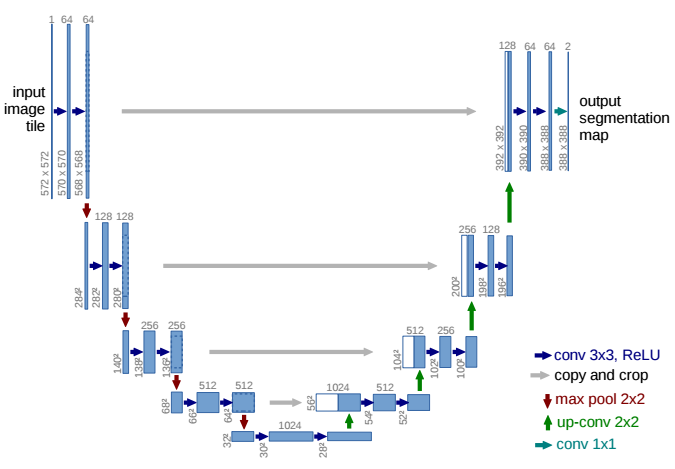
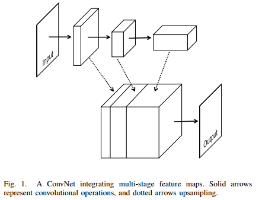
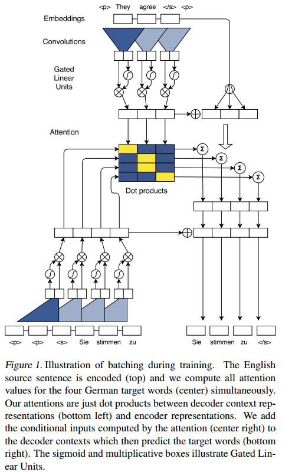
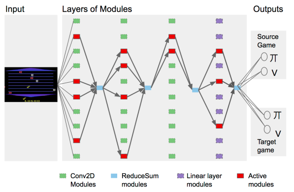

# Networks

Define some common neural network architectures and ideas.

## Computer vision

### Image classification

**Base structure**: Convolution => Activation => Pooling (AlexNet like)

**Network in Network**: Use 1x1 convolutions before the convolutions (act as fully connected layers)

**Inception**: Concatenate filters from different sizes together. Use 1x1 convolutions before and after to reduce/restore the dimensions.

**ResNet**: Use residual connections by connecting the input to the output (`y = conv(x) + x`). Between the layers of different size (for instance after pooling), use 1x1 convolution (to adapt the depth) with striding (to reduce the h/w) on the residual connection (`y = conv(x) + conv1x1(x)`).

**ResNeXt**: Similar to Inception, use multiple blocks in each layer but contrary to Inception, each block is the same. The idea is instead of having blocks with large depth (ex: 256), each block will only apply the convolution on a very small depth (ex: 4). The block are then combined by using 1x1 convolutions to restore dimentionality (ex: 4 to 256), and summing all blocks together.

 

*Aggregated Residual Transformations for Deep Neural Networks, Saining Xie, Ross Girshick, et al.*, ([Arxiv](https://arxiv.org/abs/1611.05431))

**Binary network**: The weights of each layers are either +1/-1 (multiply by a floating constant and a bias different for each layer). During forward pass, the network is binarized. During the backward pass, the weights are updated as float. A version exist which also binarize the input (XNOR network).

### Detection

**Before R-CNN**: Sliding windows to classify at each positions.

**YOLO**: Divide the image in a grid of cell. Each cell will predict multiple bounding box candidates with a confidence score (P(Obj)) and each cell predict which object would be in the cell if there was one (ex: P(Cars|Obj)). The bounding box are then thresholded using the confidence score. Each one of the w*h cells predict a vector `[[centerx, centery, w, h, P(obj)] x nb_of_proposal, [P(Car|Obj),..., P(Pers|Obj)]]`.

**SSD**: Region proposal (bounding boxes) to segment object, then classification, then overlapping detection.

### Segmentation

**U-Net**: Add skip connections between the convolutionnal encoder and the deconvolutional decoder.

 
*U-Net architecture*

*U-Net: Convolutional Networks for Biomedical Image Segmentation, Olaf Ronneberger, et al.*, ([Arxiv](https://arxiv.org/abs/1505.04597))

**Multi-task Network Cascades**: Based on ResNet to perform instance based segmentation. Use cascade loss function to divide the segmentation task into 3 sub-tasks. Each task uses as input the output of the previous one (in addition to the shared features computed by the CNN). 
*Instance-aware Semantic Segmentation via Multi-task Network Cascades, Jifeng Dai Kaiming He et al.*

**DeepMask / Multipath**: 2 networks on to segment objects independently of the class and one to give a label to the segmentation.

**Aerial Scenes Segmentation**: Data quality is important: instead of using binary mask (presence or not of the object) as ground truth, weight the mask (each pixel is weighted by the closed distance to the boundaries). Also bilinear up-sampling of the features maps (due to low resolution of the image (object to detect really small)), feed that to a FC to segment each pixel.

 
*Automatic Building Extraction in Aerial Scenes Using Convolutional Networks, Jiangye Yuan*, ([Arxiv](https://arxiv.org/abs/1602.06564))

### Image Captioning

**Show and Tell**: Use a RNN to generate a sentence using as input the feature map computed by a CNN.

### Face Recognition

**FaceNet**: Use CNN to project the face in a 128-dimensional space (on an hypersphere). Trained with triplet embedding (triplet(anchor, pos, neg)). Try to conjointly minimize dist(anchor, pos) while maximizing dist(anchor, neg).

### Other

**Neural Style**: Learn the input from white noise (the network has fixed weight and is a CNN trained on ImageNet). Isolate style and content. The loss function has two term. Style matching using Gram Matrix (capture the correlations between filters). Content matching: activations have to match the target image (same content).

**CycleGAN**: Learn conjointly two generators `F` and `G` to do conversions between two domains to perform image translation (`G(x)=y`). Trained with one discriminator for each of the generator (For `G`: `Lgan(G) =E[ log(D(y)) ] + E[ 1-log(D(G(x)) ]`) and a "cycle-consistency cost" to force the bijections `G(F(y))=y` and `F(G(x))=x` (`Lcyc=E[ |F(G(x)) - x| ] + E[ |G(F(y)) - y| ]`).

*Unpaired Image-to-Image Translation using Cycle-Consistent Adversarial Networks, Jun-Yan Zhu, et al.* ([Arxiv](https://arxiv.org/abs/1703.10593))

**Image search/retrival**: Project the image into an embedding space. Search close match using KNN with the previously indexed images. Approximate KNN with KD-Tree.

**Super resolution images**:...

**Image compression**:...

## RNN/Natural Language Processing

**RTNN**: Recursive neural tensor network (not recurrent). Tree-like shape. Use 3d tensor in addition to matrix as weights. Original model used for sentiment analysis.

**mLSTM**:  The cell state `h(t-1)` is first modified to an intermediate state dependent of the input: `m(t-1) = Wmh h(t-1) .* Wmx x(t)` before being used. This allows complex dependent transitions and can replace recurrent depth (depth between recurrent steps). Used for the Recurrent Highway Networks.

*Multiplicative LSTM for sequence modelling Ben Krause et al.*  ([Arxiv](https://arxiv.org/abs/1609.07959))

**Word2Vec**: Project each word in a high dimensional space which encode its semantic meaning (embedding).

**seq2seq**: 2 RNN. The encoder compute a though vector encoding the sentence meaning, the decoder.

**Highway Networks**: Add residual connections to the RNN cells to helps the gradient flow. The residual connection is weighted with the help of a *transform gate*: `y = T(x) * H(x) + (1 - T(x)) * x`

*Highway Networks, R. K. Srivastava, K. Greff, J. Schmidhuber* ([Arxiv](https://arxiv.org/abs/1505.00387))

**Gated Linear Unit**: New cell type which can replace LSTM for NLP tasks. Uses 1-D convolution mixed with a gate mechanism instead of an activation function. Easier to parallelize because no temporal dependencies as with recurrent models. The GLU cells are wrapped into a residual block (input is added to output).

 
*PathNet architecture*

*Language Modeling with Gated Convolutional Networks, Yann N. Dauphin et al.* ([Arxiv](https://arxiv.org/abs/1612.08083))

**Convolutional seq2seq**: Use GLU cells augmented with a decoder and an attention mechanism. The input consist of both the word embedding and the position embedding. Beat the GNMT model from Wu et al in speed and BLEU score. Use custom weight initialization adapted for the GLU.

 
*PathNet architecture*

*Convolutional Sequence to Sequence Learning, Jonas Gehring, Yann N. Dauphin et al.* ([Arxiv](https://arxiv.org/abs/1705.03122))

## Reinforcement learning

**Deep Q-Network**: Use a CNN to learn Q(s,a).

**Double Q-Learning**:

**A3C**:

**UNREAL**: Based on A3C, augment the cost function by adding auxiliary tasks.

**Evolution Strategies**: Instead of using standard back-propagation, it's possible to just randomly try to modify the weights by injecting random noise. The update step is done with the average of the candidate weights weighted by their associated reward. It is easily parallelizable (each replica can reconstruct other agent perturbations by knowing the seed). Is only competitive in settings where the gradient (of the expected reward) has to be estimated by sampling (otherwise much slower). Some tricks (virtual BN) are needed specially when the reward is difficult to reach just by randomly guessing the weights.

*Evolution Strategies as a Scalable Alternative to Reinforcement Learning, Tim Salimans, Jonathan Ho, Xi Chen, Ilya Sutskever* ([Arxiv](https://arxiv.org/abs/1703.03864))

**Neural Architecture Search**: Generate new networks architecture by formalizing a network architecture as a sequence and training a RNN to generate it using REINFORCE.

* For CNN, the network sequentially generate filter height, stride, anchors,... for each layers. The anchor allows the connect the layer to a previous one to add skip connections to the network.
* A version allows to generate RNN cells by formalising a RNN cell as a tree and sequentially generating the nodes properties.

*Neural Architecture Search with Reinforcement learning, Barret Zoph, Quoc V. Le* ([Arxiv](https://arxiv.org/abs/1611.01578))

## Other (low level)

**PathNet**: Network which can learn independent task and reusing knowledge it has already acquired. Some kind of fancy transfer learning. Works by combining genetics algorithm and gradient descent.

1. Each layers of the network is composed of multiple block/modules (small neural networks like 20 neurons FC or CNN).
2. The genetic algorithm decide which blocks are used at each layer (paths).
3. Each path is trained by conventional gradient descent for a few epoch, then the best path is kept and new paths are genetically sampled.
4. After training on one task the modules from the best path are fixed (can only be used for forward) and the unused ones are reinitialized.

 
*PathNet architecture*

*PathNet: Evolution Channels Gradient Descent in Super Neural Networks, Chrisantha Fernando, Dylan Banarse et al.* ([Arxiv](https://arxiv.org/abs/1701.08734))

**Sparsely-Gated Mixture-of-Experts**: Type of RNN cell allowing the network to have up to hundreds of billions of parameters.
* The cell contains multiples modules (experts), each containing a different neural networks.
* A gating network choose which experts are used at each timestep (gating can be sparse or continuous). During training, some noise is added to the gating output to add some stochasticity in which experts are used. A SoftMax is applied on the top-K gating predictions to weight the corresponding expert outputs. A version exist using hierarchical mixture of experts by using a tree of gating networks (the gating networks at one level determine which branches are selected at the next level).
* A contribution of the paper is about how to train that model efficiently by distributing the experts among devices and keep a batch size as big as possible.
* Two additional terms are added to the loss. One to penalize the use of always the same expert (each expert has equal importance) and one to ensure a balance load among the experts (each expert process the same number of samples, loss harder to define because non derivable). By just using the importance loss, some experts can process samples very rarely but with high SoftMax score while other can process samples more often but with low weight which impact the distributed computing efficiency.

 
*SGMoE layer*

*Outrageously Large Neural Networks: The Sparsely-Gated Mixture-of-Experts Layer, Noam Shazeer, Azalia Mirhoseini, et al.* ([Arxiv](https://arxiv.org/abs/1701.06538))

**Deep learning on graph**: Generalization of convolution to sparse data (organized as a graph). Based on the field of signal processing on graph which define operations like the Fourier transform for graphs.

**LSTM Variant**: GPU, Grid-LSTM, Bidirectional-LSTM,...

**Attention mechanism**:

**Memory networks**:

**VAE**:

**Draw**:

**Pixel**:

**PixelCNN**:

**Pix2pix**:

**WaveNet**:

...
